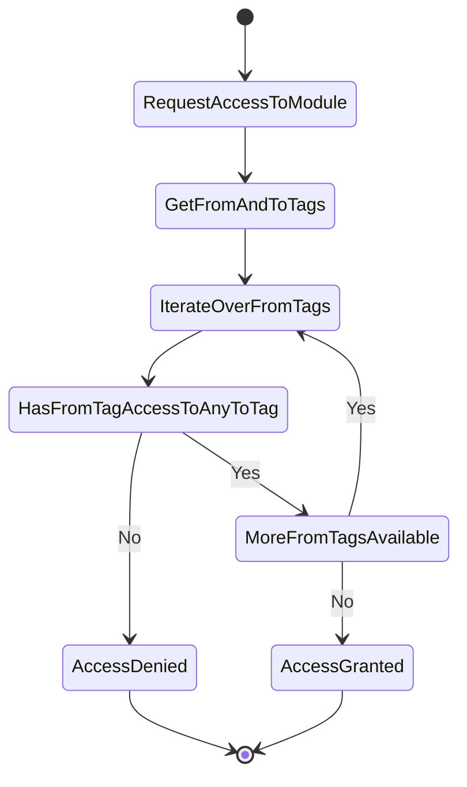
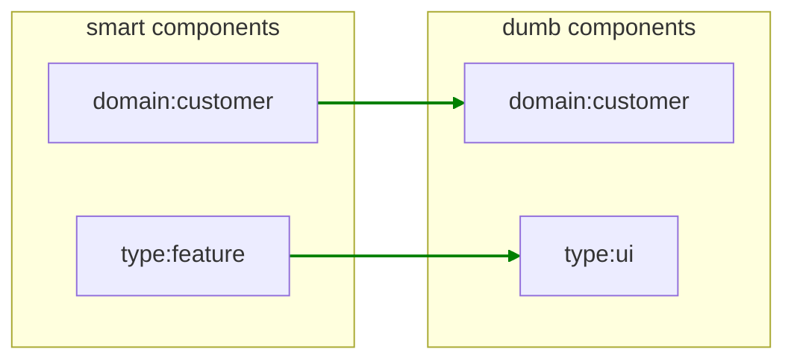
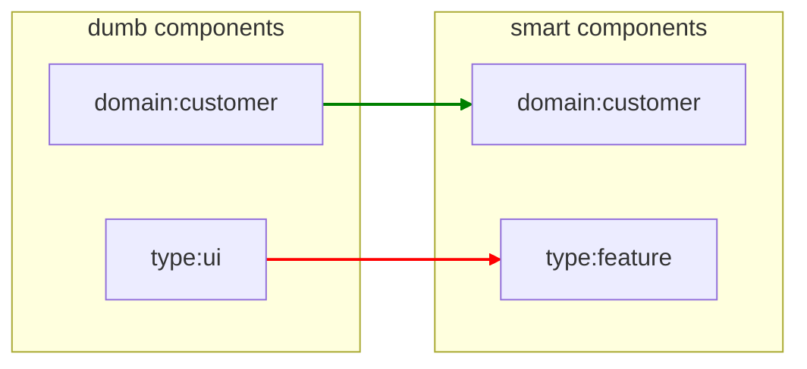
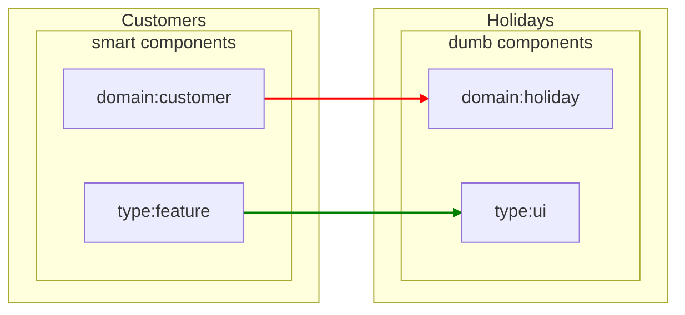
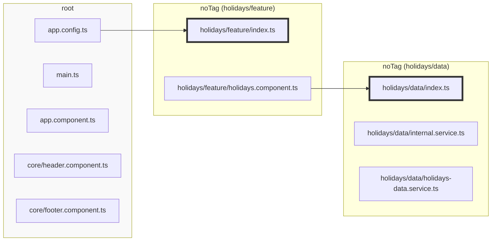

## Introduction

Dependency rules determine which modules can access each other. Since managing dependencies on a per-module basis doesn't scale well, Sheriff utilizes tags to group modules together. Dependency rules are then defined based on these tags.

Each tag specifies a list of other tags it can access. To maintain clarity, it’s best practice to categorize tags into
two groups: one for defining the module's domain/scope and another for defining the module's type.

For instance, if an application includes a customer domain and a holiday domain, these would define the domain tags.

A domain has different modules distinguished by type tags. For example, one module might contain smart components, another might have dumb components, and another might handle logic.

Domain tags could be `domain:customer` and `domain:holiday`. Type tags could be `type:feature` (for smart components),
`type:ui` (for dumb components), or `type:data` (for logic).

In this case, each module has both a domain tag and a type tag. For example, a module containing smart components for
customers would have `domain:customer` and `type:feature`. A module in the same domain but containing UI
components would have `domain:customer` and `type:ui`.

Dependency rules specify that a module tagged with `domain:customer` can only access modules with the same domain tag.
Additionally, a module tagged with `type:feature` can access modules tagged with `type:ui` and `type:data`.

When a module containing smart components needs to access a dumb component, Sheriff retrieves the tags for both modules.
It then checks each tag of the smart component module to determine if it is permitted to access the corresponding tags
of the dumb component module.



Since both modules share the same domain, access is allowed based on the domain tag. Additionally, because "type:
feature" is allowed to access "type:ui", all tags are cleared, and access is granted.



Conversely, if a dumb component tries to access a smart component, access would be denied based on the type tag.



If a smart component from the customer domain tries to access a dumb component from another domain, access would be
denied due to the domain tag.



## Automatic Tagging

Sheriff automatically detects modules and assigns the `noTag` tag to them.

A directory is detected as a module when it matches a `modules` pattern or when it contains a barrel file. The second criterion means a stray `index.ts` can create a new `noTag` module and change which tags an import is checked against. Set [`moduleIdentity: 'config'`](./configuration.md#moduleidentity) to let the `modules` configuration alone define modules.

It assigns all files that aren't part of a module to the `root` module. The root module gets the `root` tag.

It's essential to set up the dependency rules. Specifically, the [`root` tag](#the-root-tag) (i.e., the root module) needs to access all modules tagged with `noTag`.

The `depRules` property in the _sheriff.config.ts_ file defines the dependency rules. This property is an object literal where each key represents the tag of a module that wants to access another module. Its value specifies the tags it can access.

Initially, all modules can access each other, meaning that every `noTag` module can access other `noTag` modules.

The initial configuration from the [CLI](./cli) includes this setup.

Here’s an example configuration in `sheriff.config.ts`:

```typescript
import { SheriffConfig } from '@lambda-solutions/sheriff-core';

export const sheriffConfig: SheriffConfig = {
  depRules: {
    root: 'noTag',
    noTag: ['noTag', 'root'],
  },
};
```

That is also the recommendation for existing projects because it allows an incremental integration of Sheriff.

For green-field projects, the [manual tagging](#manual-tagging) is the better option.

---

To disable automatic tagging, set `autoTagging` to `false`:

```typescript
import { SheriffConfig } from '@lambda-solutions/sheriff-core';

export const sheriffConfig: SheriffConfig = {
  autoTagging: false,
  modules: {
    // see below...
  },
};
```

## The `root` Tag

Given the following project structure:

<pre>
src/app
├── main.ts
├── app.config.ts
├── app.component.ts
├── holidays
│   ├── data
│   │   ├── index.ts
│   │   ├── internal.service.ts
│   │   └── holidays-data.service.ts
│   ├── feature
│   │   ├── index.ts
│   │   └── holidays-facade.service.ts
│── core
│   ├── header.component.ts
│   ├── footer.component.ts
</pre>

The directories `src/app/holidays/data` and `src/app/holidays/feature` are barrel modules. All other files are part of the root module, which is automatically tagged with `root` by Sheriff

This tagging of the `root` module cannot be changed. With disabled barrel-less mode (`enableBarrelLess: false`), which is the default, no module can access the root module.

The property `excludeRoot` can disable this behavior. [By default](./integration). The best option, though, is to enable barrel-less mode which makes `root` a barrel-less module.



## Manual Tagging

The `modules` property in the `sheriff.config.ts` defines barrel-less modules but also assigns tags to modules, regardless if barrel or barrel-less.

The keys of `modules` represent the module directories, and the corresponding values are the tags assigned to those modules.

The following snippet demonstrates a configuration where four directories are assigned both a domain and a module type:

```typescript
import { SheriffConfig } from '@lambda-solutions/sheriff-core';

export const sheriffConfig: SheriffConfig = {
  modules: {
    'src/app/holidays/feature': ['domain:holidays', 'type:feature'],
    'src/app/holidays/data': ['domain:holidays', 'type:data'],
    'src/app/customers/feature': ['domain:customers', 'type:feature'],
    'src/app/customers/data': ['domain:customers', 'type:data'],
  },
  depRules: {},
};
```

`domain:_` and `type:_` define two dimensions for the whole project. The following rules should apply:

1. A module can only depend on other modules of the same domain.
2. A module tagged as `type:feature` can depend on `type:data`, but the reverse is not allowed.
3. The `root` module can depend on modules tagged as `type:feature`. Since the root module only has the `root` tag,
   there is no need to include domain tags.

```typescript
import { SheriffConfig } from '@lambda-solutions/sheriff-core';

export const sheriffConfig: SheriffConfig = {
  modules: {
    'src/app/holidays/feature': ['domain:holidays', 'type:feature'],
    'src/app/holidays/data': ['domain:holidays', 'type:data'],
    'src/app/customers/feature': ['domain:customers', 'type:feature'],
    'src/app/customers/data': ['domain:customers', 'type:data'],
  },
  depRules: {
    'domain:holidays': ['domain:holidays'], // Rule 1
    'domain:customers': ['domain:customers'], // Rule 1
    'type:feature': 'type:data', // Rule 2
    root: 'type:feature', // Rule 3
  },
};
```

If these rules are violated, a linting error will be triggered:

</img>

If only the modules within the director "holidays" should get tags, and the other modules should be auto-tagged, i.e. `noTag`, the configuration would look like this:

```typescript
import { SheriffConfig } from '@lambda-solutions/sheriff-core';

export const sheriffConfig: SheriffConfig = {
  modules: {
    'src/app/holidays/feature': ['domain:holidays', 'type:feature'],
    'src/app/holidays/data': ['domain:holidays', 'type:data'],
  },
  depRules: {
    'domain:holidays': ['domain:holidays', 'noTag'],
    'type:feature': ['type:data', 'noTag'],
    root: ['type:feature', 'noTag'],
    noTag: ['noTag', 'root'],
  },
};
```

Note: This setup allows any module from `domain:holidays` to depend on modules within the `customers` directory, but the reverse is not permitted.

## Nested Paths

Nested paths simplify the configuration. Multiple levels are allowed.

```typescript
import { SheriffConfig } from '@lambda-solutions/sheriff-core';

export const sheriffConfig: SheriffConfig = {
  modules: {
    'src/app': {
      holidays: {
        feature: ['domain:holidays', 'type:feature'],
        data: ['domain:holidays', 'type:data'],
      },
      customers: {
        feature: ['domain:customers', 'type:feature'],
        data: ['domain:customers', 'type:data'],
      },
    },
  },
  depRules: {
    'domain:holidays': ['domain:holidays'],
    'domain:customers': ['domain:customers'],
    'type:feature': 'type:data',
    root: ['type:feature'],
  },
};
```

## Placeholders

Placeholders help with repeating patterns. They have the syntax `<name>`, where `name` is the placeholder name.

```typescript
import { SheriffConfig } from '@lambda-solutions/sheriff-core';

export const sheriffConfig: SheriffConfig = {
  modules: {
    'src/app': {
      holidays: {
        '<type>': ['domain:holidays', 'type:<type>'],
      },
      customers: {
        '<type>': ['domain:customers', 'type:<type>'],
      },
    },
  },
  depRules: {
    'domain:holidays': ['domain:holidays'],
    'domain:customers': ['domain:customers'],
    'type:feature': 'type:data',
    root: ['type:feature'],
  },
};
```

Placeholders are available on all levels. The configuration could therefore further be improved.

```typescript
import { SheriffConfig } from '@lambda-solutions/sheriff-core';

export const sheriffConfig: SheriffConfig = {
  modules: {
    'src/app/<domain>/<type>': ['domain:<domain>', 'type:<type>'],
  },
  depRules: {
    'domain:holidays': ['domain:holidays'],
    'domain:customers': ['domain:customers'],
    'type:feature': 'type:data',
    root: ['type:feature'],
  },
};
```

## Recursive Globs (`**`) {#recursive-globs}

All matchers above span a fixed number of directory segments: `*`,
`<placeholder>` and `/regex/` each match exactly one segment. In workspaces
where modules live at varying depths, every depth would need its own key. A
`**` segment closes that gap: it matches **zero or more** directory segments.

```typescript
import { SheriffConfig } from '@lambda-solutions/sheriff-core';

export const sheriffConfig: SheriffConfig = {
  modules: {
    // feature modules at any depth below libs
    'libs/**/feature-<name>': ['type:feature', 'feature:<name>'],
    // api modules at any depth, tagged with their parent domain
    'libs/**/<domain>/api': ['type:api', 'domain:<domain>'],
  },
  depRules: {
    'type:feature': 'type:api',
    'domain:*': ({ from, to }) => from === to,
    root: '*',
  },
};
```

The rules for `**`:

- `**` must be a **complete segment**. Inside a segment (`feat**`) the `*`
  characters keep their single-segment wildcard meaning.
- `**` matches **zero** segments too: `libs/**/api` also matches `libs/api`.
- `**` never captures a placeholder; `<domain>` still matches exactly one
  segment.
- A trailing `**` makes every directory below (and including) the prefix a
  module: `'src/**'` is the explicit "every folder is a module" setup.
- Directory discovery driven purely by `**` skips `node_modules` and
  dot-directories (such as `.git`). An explicit segment
  (`'node_modules/<pkg>'`) still matches them.
- Key order still decides between overlapping keys: the first matching key
  wins, so place more specific keys before their `**` counterparts.
- For file-level `exports`, a pattern without `**` always outranks a
  pattern with `**` when both match the same module.

## `denyRules`

Use `denyRules` when a tag must restrict dependencies even if `depRules` would
otherwise allow them. Sheriff evaluates `denyRules` after `depRules`, and a
matching deny rule always wins over an allow rule.

```typescript
import { SheriffConfig } from '@lambda-solutions/sheriff-core';

export const sheriffConfig: SheriffConfig = {
  modules: {
    'src/domain': ['domain:booking', 'type:domain'],
    'src/shared': ['shared'],
  },
  depRules: {
    '*': 'shared',
    'domain:*': 'shared',
    'type:domain': 'type:domain',
  },
  denyRules: {
    'type:domain': ({ to }) => to !== 'type:domain',
  },
};
```

With this configuration, `src/domain` cannot import `src/shared`. The dependency
first receives clearance from `depRules`, then `denyRules` rejects it because the
importing module has `type:domain` and the target does not.

`denyRules` do not grant access. If `depRules` do not allow an import,
`denyRules` cannot make it valid. A source tag without a matching `denyRules`
entry is normal and does not raise a missing-rule error.

## `externalRules`

`externalRules` restrict imports from external libraries in `node_modules`.
The keys match the importing module's tags, while each value is an allow-list
of library patterns:

```typescript
import { SheriffConfig } from '@lambda-solutions/sheriff-core';

export const sheriffConfig: SheriffConfig = {
  modules: {
    'src/domain': ['type:domain'],
    'src/api': ['type:api'],
    'src/infra': ['type:infra'],
  },
  depRules: {
    '*': '*',
  },
  externalRules: {
    'type:domain': [],
    'type:api': ['@angular/core'],
    'type:infra': ['@angular/*', 'rxjs'],
  },
};
```

Sheriff matches library wildcards against the full import string. An exact
`@angular/core` pattern therefore does not allow `@angular/core/testing`, while
`@angular/*` allows both. Rule keys are wildcard-aware as well, so `type:*`
can govern every type tag.

Every matching restriction must allow the import. This gives modules carrying
multiple tags AND semantics: if one matching tag allows a library and another
matching tag rejects it, Sheriff reports the vetoing tag. An empty array
rejects all external libraries. A tag for which no key matches is unrestricted,
so omitting `externalRules` preserves the previous behavior.

If TypeScript cannot resolve a bare package import, Sheriff also checks the
nearest `package.json` up to the project root. Packages declared in
`dependencies`, `peerDependencies`, or `optionalDependencies` are still
governed by `externalRules` even when they are not installed. Undeclared,
unresolvable imports remain unresolvable and are not checked as externals.
A tsconfig path alias that matches but fails to resolve also falls into this
fallback; when the same name is declared in `package.json`, as with workspace
packages, Sheriff treats it as external. Manifest reads are cached for one
Sheriff run.

A matcher function can make the decision from the full external import and the
importing module context:

```typescript
externalRules: {
  'type:api': ({ externalLibrary, from }) =>
    externalLibrary === '@angular/core' && from === 'type:api',
}
```

## `depRules` Functions & Wildcards

`depRules` allows functions instead of static values. The names of the tags can include wildcards:

```typescript
import { SheriffConfig } from '@lambda-solutions/sheriff-core';

export const sheriffConfig: SheriffConfig = {
  modules: {
    'src/app/<domain>/<type>': ['domain:<domain>', 'type:<type>'],
  },
  depRules: {
    'domain:*': ({ from, to }) => from === to,
    'type:feature': 'type:data',
    root: ['type:feature'],
  },
};
```

or use `sameTag`, which is a pre-defined function.

```typescript
import { sameTag, SheriffConfig } from '@lambda-solutions/sheriff-core';

export const sheriffConfig: SheriffConfig = {
  modules: {
    'src/app/<domain>/<type>': ['domain:<domain>', 'type:<type>'],
  },
  depRules: {
    'domain:*': [sameTag, 'shared'],
    'type:feature': 'type:data',
    root: ['type:feature'],
  },
};
```

### The Rule Context

A `depRules` matcher function receives one object:

| Property         | Type       | Meaning                                                    |
| ---------------- | ---------- | ---------------------------------------------------------- |
| `from`           | `string`   | The single source tag currently being evaluated             |
| `to`             | `string`   | The single target tag currently being evaluated             |
| `fromTags`       | `string[]` | **All** tags of the importing module                        |
| `toTags`         | `string[]` | **All** tags of the imported module                         |
| `fromModulePath` | `string`   | Path of the importing module                                |
| `toModulePath`   | `string`   | Path of the imported module                                 |
| `fromFilePath`   | `string`   | Path of the importing file                                  |
| `toFilePath`     | `string`   | Path of the imported file                                   |

`from` and `to` are a single tag each, because Sheriff evaluates every
source/target tag combination separately (see
[How Multiple `depRules` Match](#how-multiple-deprules-match)). `fromTags` and
`toTags` give the full picture, which is what you need for marker tags — asking
"does the target *also* carry `port`?" is impossible with `to` alone:

```typescript
depRules: {
  // A feature may reach another feature only through its public port.
  'feature:*': [sameTag, ({ toTags }) => toTags.includes('port')],

  // `type:feature` is carried by both a slice root and every `feat-<x>/`
  // folder. Only the slice root wires the implementation; `entry` tells them
  // apart without re-deriving module identity from the file path.
  'type:feature': ({ to, fromTags }) =>
    to.startsWith('type:') && (to !== 'type:infra' || fromTags.includes('entry')),
}
```

An `externalRules` matcher gets a smaller context: `from`, `fromTags`,
`fromModulePath`, `fromFilePath` and `externalLibrary`.

:::warning `fromTags` and `toTags` are fork-only
These two properties do **not** exist in upstream
[`@softarc/sheriff-core`](https://www.npmjs.com/package/@softarc/sheriff-core),
whose rule context is limited to `fromModulePath`, `toModulePath`,
`fromFilePath` and `toFilePath`.

This matters because the degradation is silent rather than loud. On upstream the
properties are `undefined`, so a guard like
`to !== 'type:infra' || fromTags?.includes('entry')` does not throw — it
collapses to permanently `true`, and the rule keeps reporting success while
enforcing nothing. A rule can therefore pass its tests against this fork and
allow everything upstream.

If your config must run against both, avoid these two properties, or assert
their presence explicitly at the top of the rule so a missing context fails
loudly instead of silently.
:::

### How Multiple `depRules` Match

When Sheriff checks an import, every source tag of the importing module must
have clearance. Source tags are therefore combined with AND.

For a single source tag, however, multiple `depRules` keys can match. Sheriff
evaluates all matching keys until a rule value returns `true`; those matches are
combined with OR, and the first `true` wins. Target tags are also checked as
alternatives: a source tag has clearance when it can access any tag of the
imported module.

This matters for modules with several tags. A permissive wildcard rule can grant
clearance even if a more specific rule would not:

```typescript
import { noDependencies, SheriffConfig } from '@lambda-solutions/sheriff-core';

export const sheriffConfig: SheriffConfig = {
  modules: {
    'src/domain': ['domain:booking', 'type:domain'],
    'src/shared': ['shared'],
  },
  depRules: {
    '*': 'shared',
    'domain:*': 'shared',
    'type:domain': noDependencies,
  },
};
```

In this configuration, `src/domain` may import `src/shared`. The `domain:booking`
source tag has clearance through `*` and `domain:*`. The `type:domain` source tag
also has clearance because `*` matches it and allows `shared`; `noDependencies`
does not make the module stricter because `depRules` only grant clearance, they
do not subtract it.

Use [`denyRules`](#denyrules) when a tag must veto dependencies that another
matching `depRules` key would allow.
